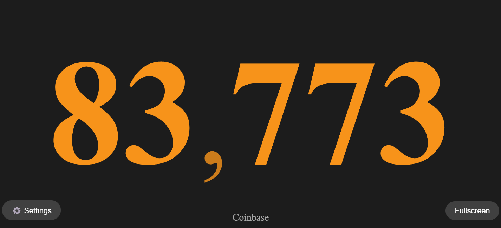
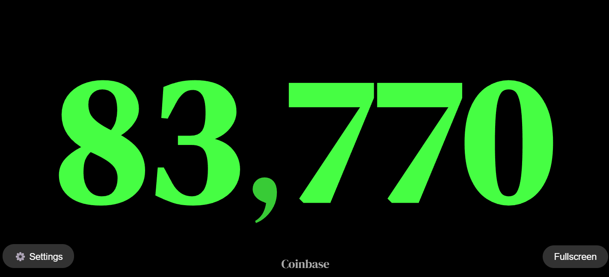
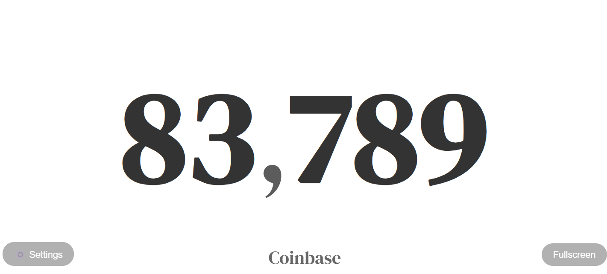

# Dedicated Bitcoin Price Display

Turn any old mobile phone or tablet into a dedicated Bitcoin price display! Connect to the fastest price APIs (with automatic failover between various sources) to show the current BTC price as large as possible on your screen.
     
## Features

- **Giant Price Display**: Shows price as large as possible
- **Multiple APIs**: Sources listed below
- **Automatic Failover**: If one API fails, it switches to the next quickest API automatically
- **Dynamic Update Frequency**: Uses the fastest API available
- **Auto-scaling**: Adapts to any screen size or orientation
- **Fullscreen Mode**: Click anywhere to exit fullscreen
- **Style Changes**: 12 Fonts, custom colors, and sizing

## How to Use

Run in browser & hit Fullscreen button (iOS instructions below):  
- <a href="https://dropthepress.github.io/Dedicated-Bitcoin-Price-Display/BitcoinDisplay.html" target="_blank">Click here</a>
  
Download to run locally (open file with internet browser):  
- <a href="BitcoinDisplayClock.html" download>BitcoinDisplayClock.html</a>

## iPhone & iPad troubleshooting: 

1. If fullscreen mode does not work, try adding the website to your home Screen as an app
   - Press the Share button > Add to Home Screen
2. In Safari, hit the menu button and toggle "Hide Toolbar"

## API Sources

The display auto-connects to the fastest API source available:

1. Coinbase (5-second updates)
3. Bitstamp (5-second updates)
4. Gemini (7-second updates)
5. Bittrex (12-second updates)
6. Bitfinex (12-second updates)
7. Kraken (15-second updates)
8. Blockchain.info (15-second updates)
9. CoinGecko (45-second updates)
10. Coindesk (60-second updates)

## License

This project is free to use and modify.

## Screenshot

Choose from 12 fonts, custom colors, and custom font size!

